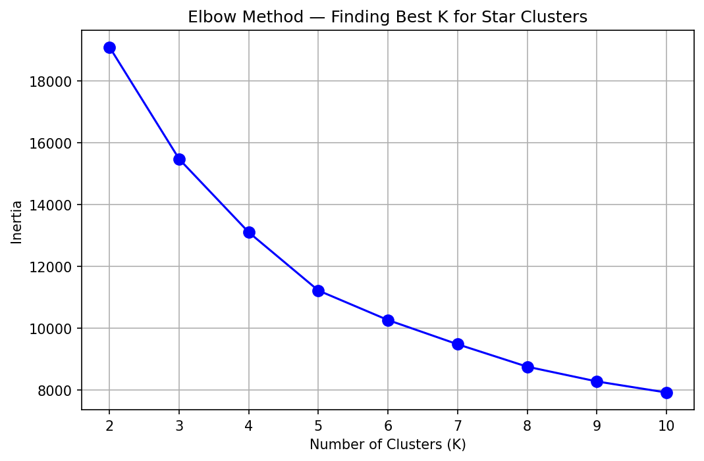
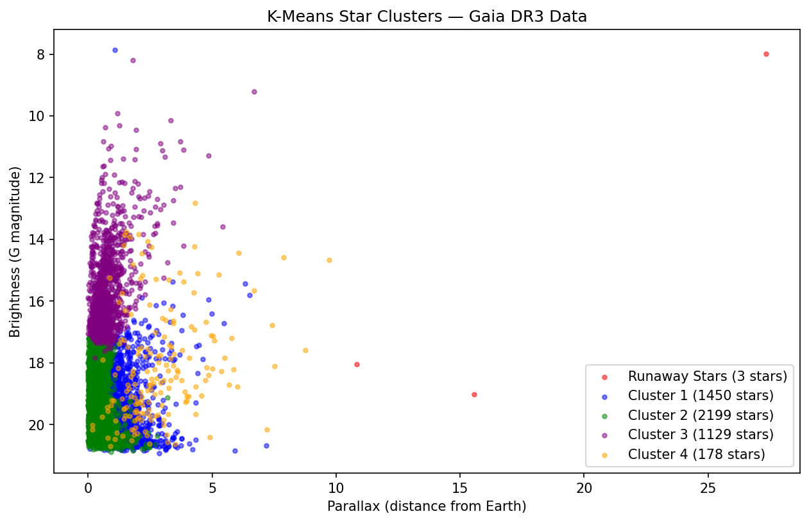
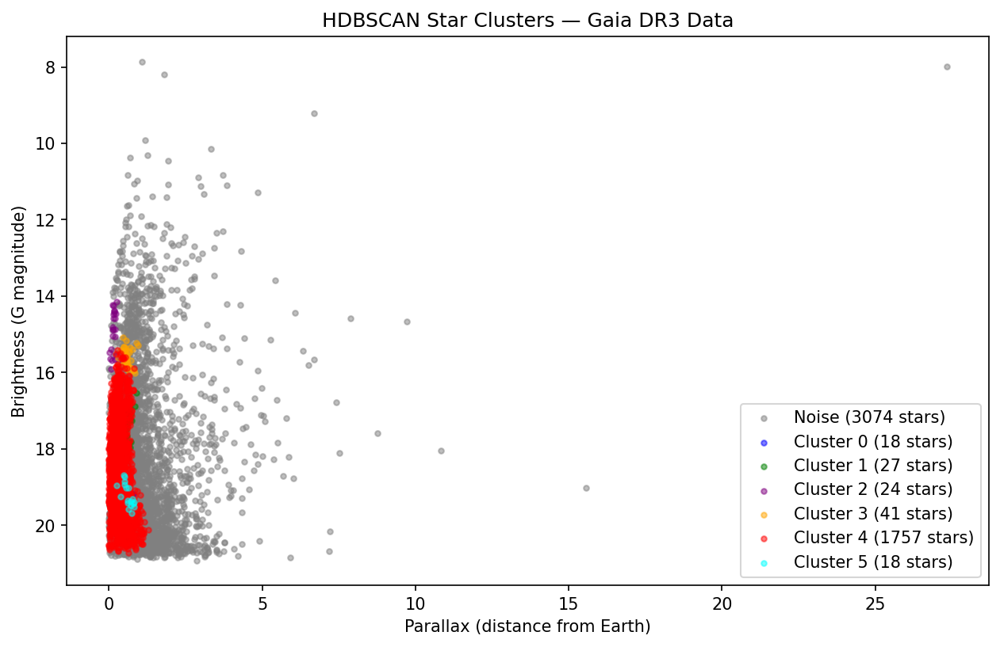
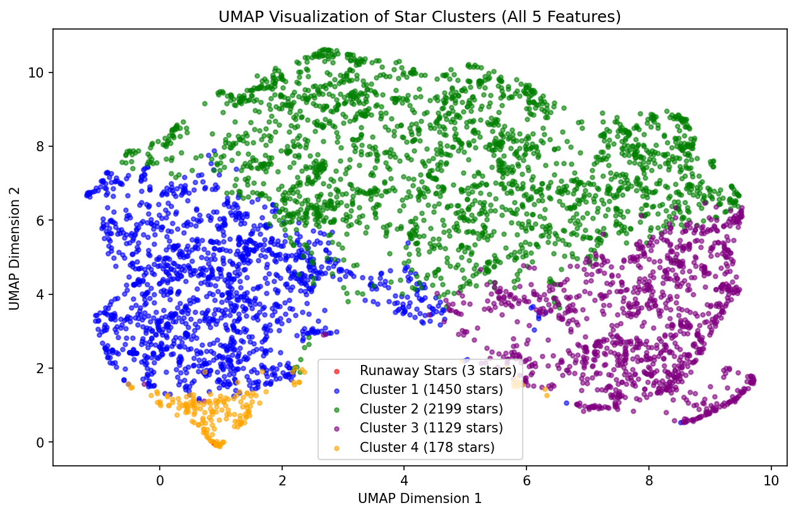

# 🌟 Stellar Population Clustering using NASA Gaia DR3 Data

## Project Overview
An end-to-end unsupervised machine learning pipeline that fetches real star data 
from NASA/ESA's Gaia DR3 catalog and identifies distinct stellar populations 
using clustering algorithms.

## 🔍 Key Findings
- Identified **5 distinct stellar populations** from 4959 stars
- Discovered **3 anomalous runaway star candidates** with extreme proper motion (130-168 mas/yr)
- UMAP confirmed real cluster structure across all 5 features
- HDBSCAN revealed 3074 stars genuinely don't belong to any dense group

## 🛠️ Tech Stack
- **Data Source**: NASA/ESA Gaia DR3 catalog (live API fetch)
- **Languages**: Python
- **Libraries**: astroquery, pandas, numpy, scikit-learn, hdbscan, umap-learn, matplotlib
- **Environment**: Jupyter Notebook

## 📊 ML Pipeline
1. **Data Collection** — Fetched 5000 stars live from Gaia DR3 via astroquery
2. **Data Cleaning** — Removed null values, dropped non-feature columns
3. **Feature Scaling** — StandardScaler (chosen over MinMaxScaler due to astronomical outliers)
4. **Elbow Method** — Determined optimal K=5 clusters
5. **K-Means Clustering** — Baseline clustering into 5 stellar populations
6. **HDBSCAN Clustering** — Density-based clustering, automatic K, honest noise labeling
7. **UMAP Visualization** — 5D → 2D compression confirming real cluster structure

## 📈 Results

### Elbow Method


### K-Means Clusters


### HDBSCAN Clusters


### UMAP Visualization


## 🌠 Cluster Interpretation
| Cluster | Stars | Description |
|---------|-------|-------------|
| Green | 2199 | Ordinary background stars — faint & distant |
| Blue | 1450 | Average nearby stellar population |
| Purple | 1129 | Luminous distant stars |
| Orange | 178 | Close neighbourhood stars |
| Red | 3 | Anomalous runaway star candidates |

## 🚀 How to Run
```bash
git clone https://github.com/YOUR_USERNAME/stellar-clustering
cd stellar-clustering
pip install -r requirements.txt
jupyter notebook Astronomer.ipynb
```

## 📚 Data Source
European Space Agency Gaia DR3 Catalog  
https://gea.esac.esa.int/archive/


## Live Demo
[Click here to see the live app](https://atharva110409-stellar-clustering-app-ddtulj.streamlit.app/)
